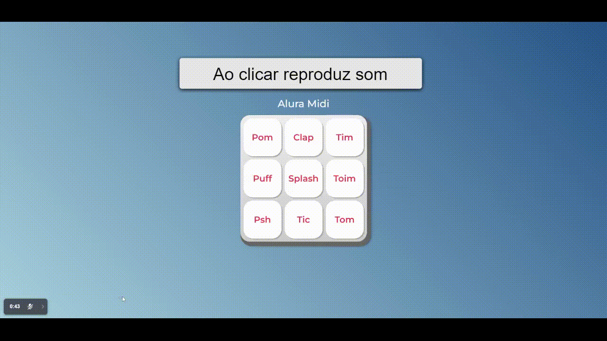

<h1 align="center">Projeto aluramidi</h1>

Projeto da aula "Javascript para web: Crie páginas dinâmicas"

 ## Sobre o projeto
<h4 align="center">O projeto tem como foco aplicar o javaScript para que o mesmo altere a cor dos botões por meio de teclado e cliques, para reproduzir sons.</h4>

## Acesso ao projeto
- [🔗Alura MIDI](https://swaveng.github.io/projeto-aluramidi/)

## Agradecimento

    

        <a href="https://www.alura.com.br/">
            
            
(Plataforma do curso)

        </a>
    

    

        <a href="https://github.com/ikyrie">
            
            
Vanessa Me Tonini (Instrutora)

        </a>
    

